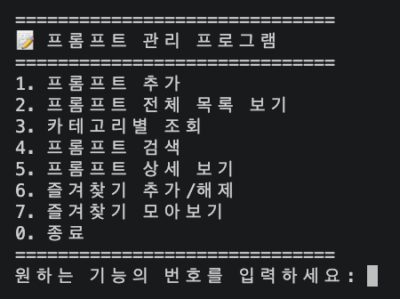
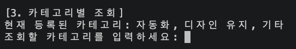

# VSCode Prompt Manager 🚀

**VSCode Prompt Manager**는 개발자 및 AI 사용자를 위해 설계된 터미널 기반 프롬프트 관리 프로그램입니다. 자주 사용하는 프롬프트를 체계적으로 저장, 수정, 관리하고 필요할 때 빠르게 사용할 수 있도록 도와줍니다.

---

## 🚀 실행 방법 (설치 불필요)

본 프로그램은 단일 파이썬 스크립트(`main.py`)로 동작하므로 별도의 복잡한 설치 과정이 필요하지 않습니다. 

1. 터미널(Terminal) 또는 명령 프롬프트(CMD)를 엽니다.
2. `main.py` 파일이 저장된 디렉토리로 이동합니다.
3. 아래 명령어를 입력하여 프로그램을 실행합니다:

```bash
python main.py
```




---

## ✨ 기능 목록

1. **프롬프트 추가 (`1`)**
   * 새로운 프롬프트를 작성하고 기존 카테고리를 선택하거나 새로운 카테고리를 직접 입력하여 저장할 수 있습니다.
2. **프롬프트 목록 조회 (`2`, `3`)**
   * 저장된 전체 프롬프트 목록을 확인하거나, 특정 카테고리에 속한 프롬프트만 모아서 볼 수 있습니다.
3. **프롬프트 검색 (`4`)**
   * 제목이나 내용에 포함된 키워드를 통해 수많은 프롬프트 중 원하는 것을 빠르게 찾아냅니다.
4. **프롬프트 상세 보기 (`5`)**
   * 프롬프트의 ID 번호를 입력하여 전체 내용을 자세히 확인할 수 있습니다.
5. **즐겨찾기 관리 (`6`, `7`)**
   * 자주 사용하는 핵심 프롬프트들을 즐겨찾기에 등록/해제하고, 즐겨찾기된 항목만 별도로 모아볼 수 있습니다.


> *프롬프트를 추가하거나 검색하는 실습 애니메이션(GIF) 또는 스크린샷을 추가해주세요.*

---

## 📂 등록된 프롬프트 카테고리 설명

현재 시스템에는 다음과 같은 카테고리가 기본적으로 등록되어 있으며, 사용자가 자유롭게 추가할 수 있습니다.

### ⚙️ 자동화
* **(예시 프롬프트 등록됨: 메일 작성 자동화)** 특정한 상황이나 조건에 따라 반복적인 업무(예: 메일 작성)를 자동으로 처리하거나 템플릿화하는 프롬프트를 저장합니다.

### ✨ 디자인 유지
* **(예시 프롬프트 등록됨: APPLE 디자인)** 특정 브랜드의 디자인 가이드라인, 색상, 타이포그래피 등의 일관성을 유지하기 위한 참조용 프롬프트 및 가이드를 저장합니다.

### 💼 기타
* **(예시 프롬프트 등록됨: N값 정상 수치 판별)** 위 카테고리에 속하지 않는 전문 지식 검증, 데이터 판별 등 다목적 프롬프트를 저장합니다.



